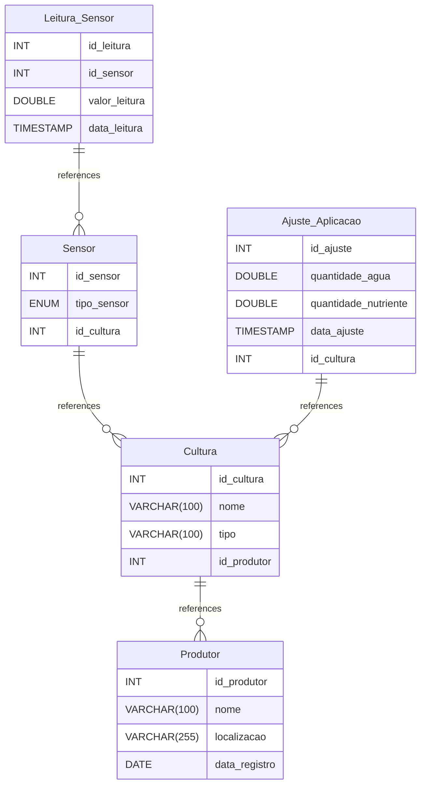

# FarmTech Sensors documentation

> [!NOTE]
> This project is part of a course in Artificial Intelligence at [FIAP](https://github.com/fiap). This repository is the activity 1 from phase 2.

## Summary

- [FarmTech Sensors documentation](#farmtech-sensors-documentation)
  - [Summary](#summary)
  - [Introduction](#introduction)
  - [Database type](#database-type)
  - [Table structure](#table-structure)
    - [Produtor](#produtor)
    - [Cultura](#cultura)
    - [Sensor](#sensor)
      - [Enums](#enums)
        - [tipo\_sensor](#tipo_sensor)
    - [Leitura\_Sensor](#leitura_sensor)
    - [Ajuste\_Aplicacao](#ajuste_aplicacao)
  - [Relationships](#relationships)
  - [Database Diagram](#database-diagram)

## Introduction

## Database type

- **Database system:** Generic
## Table structure

### Produtor

| Name        | Type          | Settings                      | References                    | Note                           |
|-------------|---------------|-------------------------------|-------------------------------|--------------------------------|
| **id_produtor** | INT | 🔑 PK, not null , autoincrement |  | |
| **nome** | VARCHAR(100) | not null  |  | |
| **localizacao** | VARCHAR(255) | not null  |  | |
| **data_registro** | DATE | not null  |  | | 

### Cultura

| Name        | Type          | Settings                      | References                    | Note                           |
|-------------|---------------|-------------------------------|-------------------------------|--------------------------------|
| **id_cultura** | INT | 🔑 PK, not null , autoincrement |  | |
| **nome** | VARCHAR(100) | not null  |  | |
| **tipo** | VARCHAR(100) | not null  |  | |
| **id_produtor** | INT | not null  | Cultura_id_produtor_fk | | 

### Sensor

| Name        | Type          | Settings                      | References                    | Note                           |
|-------------|---------------|-------------------------------|-------------------------------|--------------------------------|
| **id_sensor** | INT | 🔑 PK, not null , autoincrement |  | |
| **tipo_sensor** | ENUM | not null  |  | |
| **id_cultura** | INT | not null  | Sensor_id_cultura_fk | | 

#### Enums
##### tipo_sensor

- umidade
- pH
- nutrientes

### Leitura_Sensor

| Name        | Type          | Settings                      | References                    | Note                           |
|-------------|---------------|-------------------------------|-------------------------------|--------------------------------|
| **id_leitura** | INT | 🔑 PK, not null , autoincrement |  | |
| **id_sensor** | INT | not null  | Leitura_Sensor_id_sensor_fk | |
| **valor_leitura** | DOUBLE | not null  |  | |
| **data_leitura** | TIMESTAMP | not null , default: CURRENT_TIMESTAMP |  | | 

### Ajuste_Aplicacao

| Name        | Type          | Settings                      | References                    | Note                           |
|-------------|---------------|-------------------------------|-------------------------------|--------------------------------|
| **id_ajuste** | INT | 🔑 PK, not null , autoincrement |  | |
| **quantidade_agua** | DOUBLE | not null  |  | |
| **quantidade_nutriente** | DOUBLE | not null  |  | |
| **data_ajuste** | TIMESTAMP | not null , default: CURRENT_TIMESTAMP |  | |
| **id_cultura** | INT | not null  | Ajuste_Aplicacao_id_cultura_fk | | 

## Relationships

- **Cultura to Produtor**: many_to_one
- **Sensor to Cultura**: many_to_one
- **Leitura_Sensor to Sensor**: many_to_one
- **Ajuste_Aplicacao to Cultura**: many_to_one

## Database Diagram

