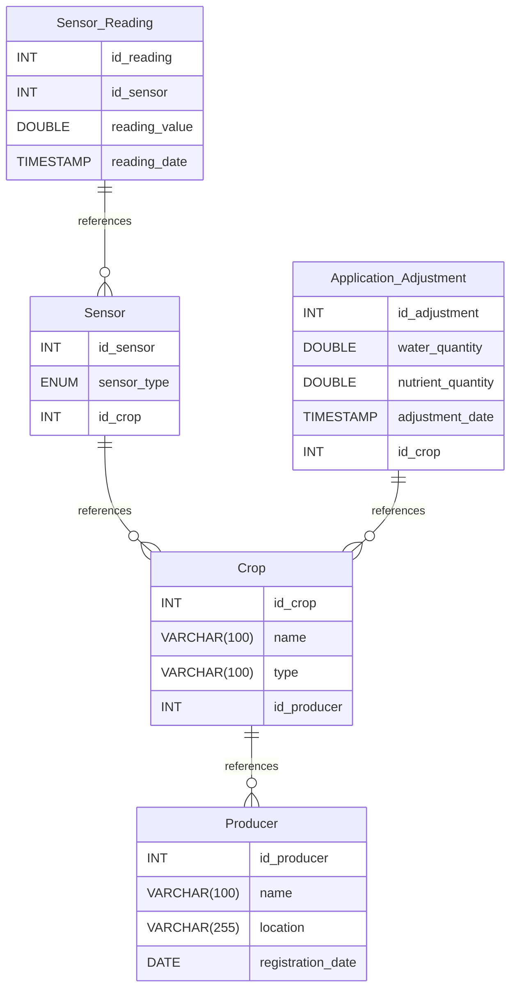

# FarmTech Sensors documentation

> [!NOTE]
> This project is part of a course in Artificial Intelligence at [FIAP](https://github.com/fiap). This repository is the activity 1 from phase 2.

## Summary

- [FarmTech Sensors documentation](#farmtech-sensors-documentation)
	- [Summary](#summary)
	- [Introduction](#introduction)
	- [Database type](#database-type)
	- [Table structure](#table-structure)
		- [Producer](#producer)
		- [Crop](#crop)
		- [Sensor](#sensor)
			- [Enums](#enums)
				- [sensor\_type](#sensor_type)
		- [Sensor\_Reading](#sensor_reading)
		- [Application\_Adjustment](#application_adjustment)
	- [Relationships](#relationships)
	- [Database Diagram](#database-diagram)

## Introduction

## Database type

- **Database system:** Generic
## Table structure

### Producer

| Name        | Type          | Settings                      | References                    | Note                           |
|-------------|---------------|-------------------------------|-------------------------------|--------------------------------|
| **id_producer** | INT | 🔑 PK, not null , autoincrement |  | |
| **name** | VARCHAR(100) | not null  |  | |
| **location** | VARCHAR(255) | not null  |  | |
| **registration_date** | DATE | not null  |  | | 

### Crop

| Name        | Type          | Settings                      | References                    | Note                           |
|-------------|---------------|-------------------------------|-------------------------------|--------------------------------|
| **id_crop** | INT | 🔑 PK, not null , autoincrement |  | |
| **name** | VARCHAR(100) | not null  |  | |
| **type** | VARCHAR(100) | not null  |  | |
| **id_producer** | INT | not null  | Crop_id_producer_fk | | 

### Sensor

| Name        | Type          | Settings                      | References                    | Note                           |
|-------------|---------------|-------------------------------|-------------------------------|--------------------------------|
| **id_sensor** | INT | 🔑 PK, not null , autoincrement |  | |
| **sensor_type** | ENUM | not null  |  | |
| **id_crop** | INT | not null  | Sensor_id_crop_fk | | 

#### Enums
##### sensor_type

- humidity
- pH
- nutrients

### Sensor_Reading

| Name        | Type          | Settings                      | References                    | Note                           |
|-------------|---------------|-------------------------------|-------------------------------|--------------------------------|
| **id_reading** | INT | 🔑 PK, not null , autoincrement |  | |
| **id_sensor** | INT | not null  | Sensor_Reading_id_sensor_fk | |
| **reading_value** | DOUBLE | not null  |  | |
| **reading_date** | TIMESTAMP | not null , default: CURRENT_TIMESTAMP |  | | 

### Application_Adjustment

| Name        | Type          | Settings                      | References                    | Note                           |
|-------------|---------------|-------------------------------|-------------------------------|--------------------------------|
| **id_adjustment** | INT | 🔑 PK, not null , autoincrement |  | |
| **water_quantity** | DOUBLE | not null  |  | |
| **nutrient_quantity** | DOUBLE | not null  |  | |
| **adjustment_date** | TIMESTAMP | not null , default: CURRENT_TIMESTAMP |  | |
| **id_crop** | INT | not null  | Application_Adjustment_id_crop_fk | | 

## Relationships

- **Crop to Producer**: many_to_one
- **Sensor to Crop**: many_to_one
- **Sensor_Reading to Sensor**: many_to_one
- **Application_Adjustment to Crop**: many_to_one

## Database Diagram

